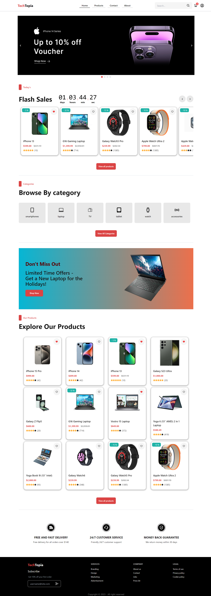
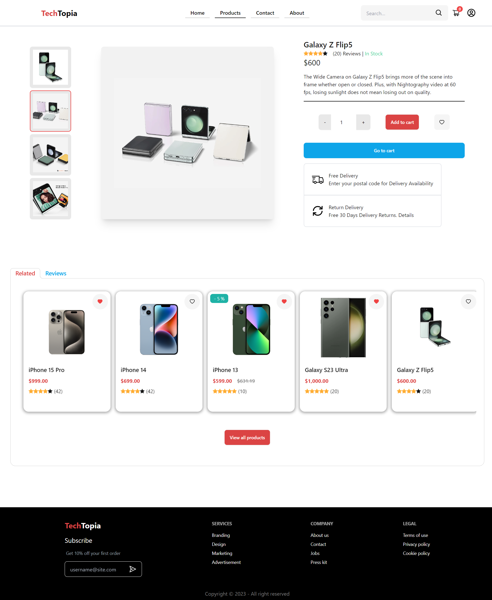
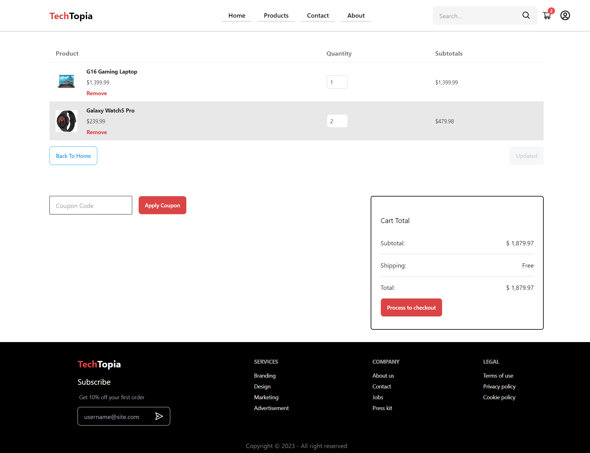
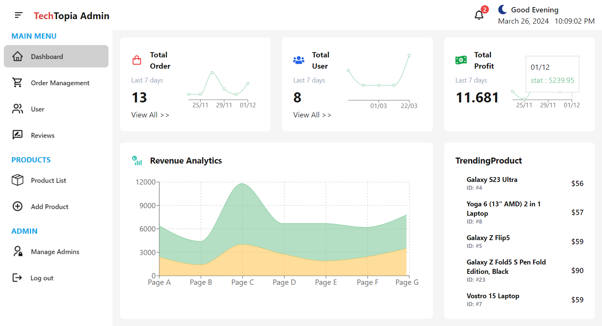

# FullStack Ecommerce TechTopia

This repository contains the source code for a FullStack Ecommerce project called TechTopia using ReactJS and Flask.

## Introduction

TechTopia is an ecommerce platform developed using full-stack technologies. It provides a platform for users to browse, purchase, and sell tech-related products. The project aims to demonstrate the implementation of essential ecommerce functionalities and showcase proficiency in various web development technologies.

## Features

- **User Authentication**: Allow users to sign up, log in, and manage their accounts securely.
- **Product Catalog**: Browse through a wide range of tech products, sorted by categories and subcategories.
- **Shopping Cart**: Users can add products to their cart, manage quantities, and proceed to checkout.
- **Checkout Process**: Secure payment gateway integration for seamless transactions.
- **Seller Dashboard**: Sellers can manage their product listings, inventory, and orders.
- **Admin Panel**: Admin can manage users, products, categories, and monitor system activities.
- **Mobile-friendly**: Provide responsive interfaces that are easy to navigate and interact with on smaller screens.

## Technologies Used

- **Frontend**:
  - HTML/CSS
  - JavaScript, TypeScript (ReactJS)
  - DaisyUI (styling components for TailwindCSS)
  - TailwindCSS (for styling)
  - Recharts, sweetalert2, ...

- **Backend**:
  - Flask
  - SQLite3 

- **Authentication**:
  - JSON Web Tokens (JWT)
  - Password hashing

- **Payment Gateway Integration**:
  - Stripe API

## Screenshots

Here are some screenshots showcasing the UI of TechTopia:
1. **Home Page**:


2. **Product Page**:


3. **Shopping Cart**:


4. **Admin Dashboard**:

  
- See more in the screenshot folder

## Installation

1. Clone the repository:

```bash
git clone https://github.com/DQuang7403/FullStack_Ecommerce.git
```
2. Install Dependencies
- Navigate to the cloned repository directory:
    ```bash
    cd FullStack_Ecommerce
    ```
- Install frontend dependencies
    ```bash
    cd frontend
    npm install
    ```
    ```bash
    cd ../admin
    npm install
    ```
- Install Backend dependencies
    ```bash
    cd ../backend
    pip install -r requirements.txt
    ```
3. Start the Development Server
- Frontend (Client)
    ```bash
    cd frontend
    npm run dev
    ```
- Frontend (Admin)
    ```bash
    cd admin
    npm run dev
    ```
- Backend 
    ```bash
    cd backend
    py app.py
    ```
4. Stripe Checkout Setup
- You can refer the following URL for more information
    - https://www.youtube.com/watch?v=Y9EpPc19xjw
    - https://stripe.com/payments/checkout
5. Access the Application:
- Once both frontend, admin and backend servers are running, visit http://localhost:5173/ in your web browser to access the TechHub application or visit http://localhost:3000/ to access the admin dashboard.
